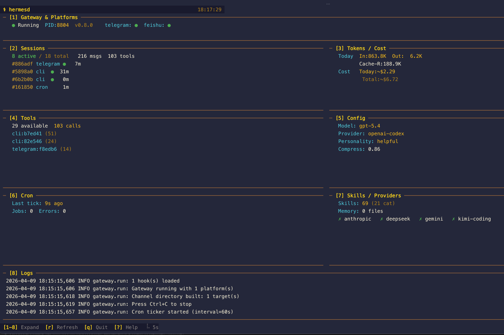
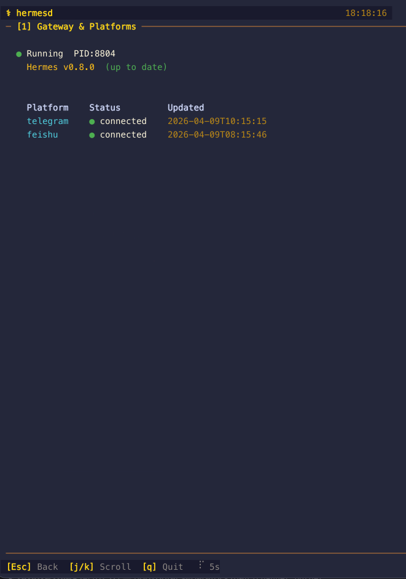
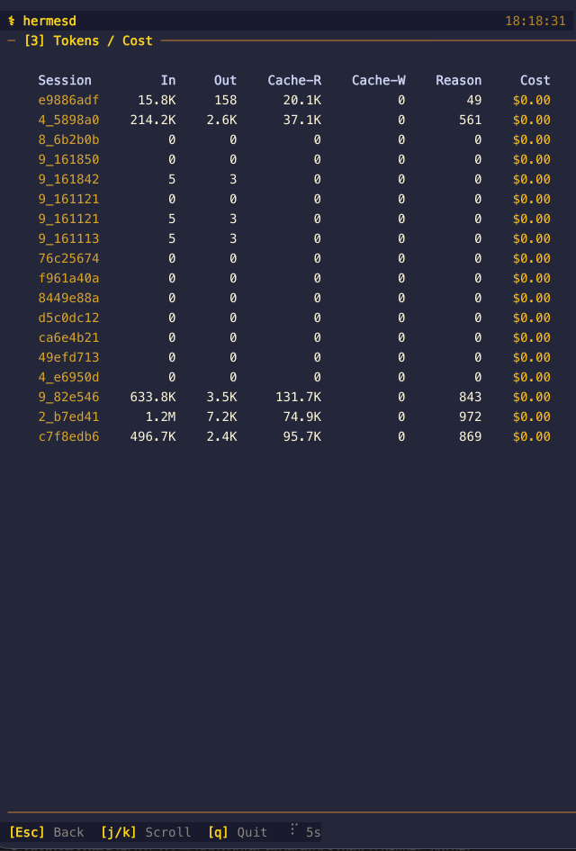
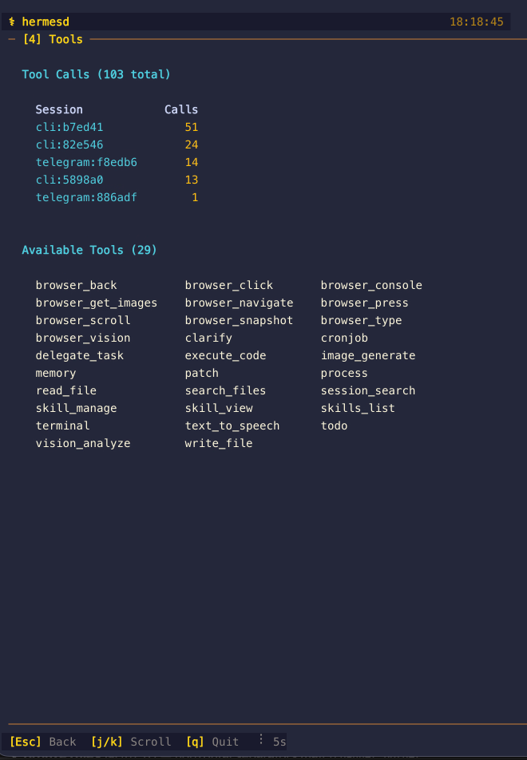
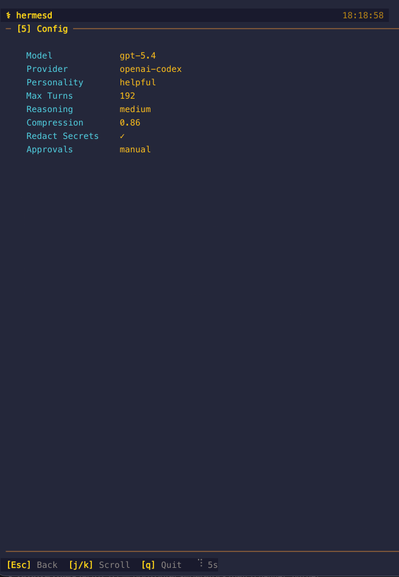
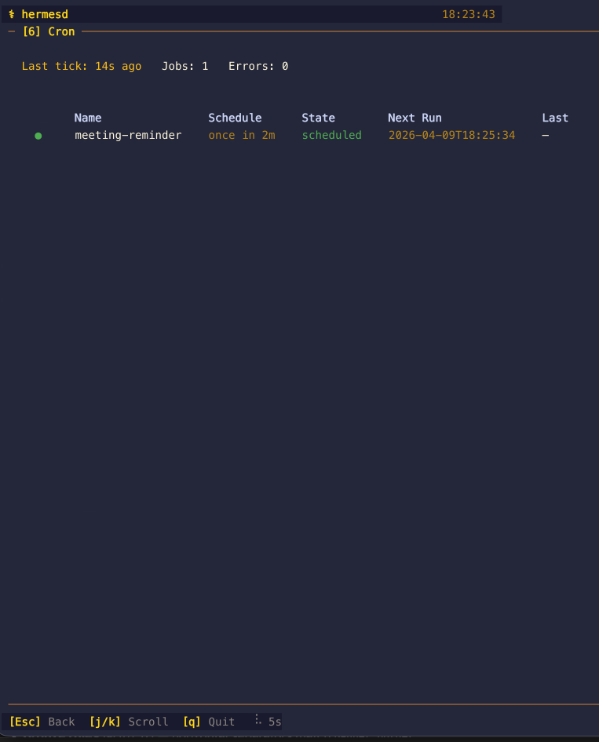
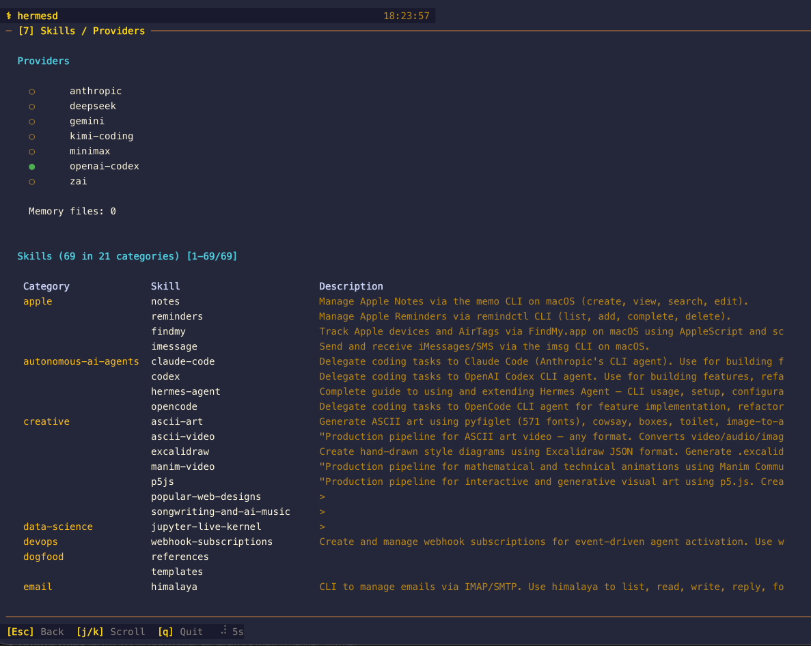
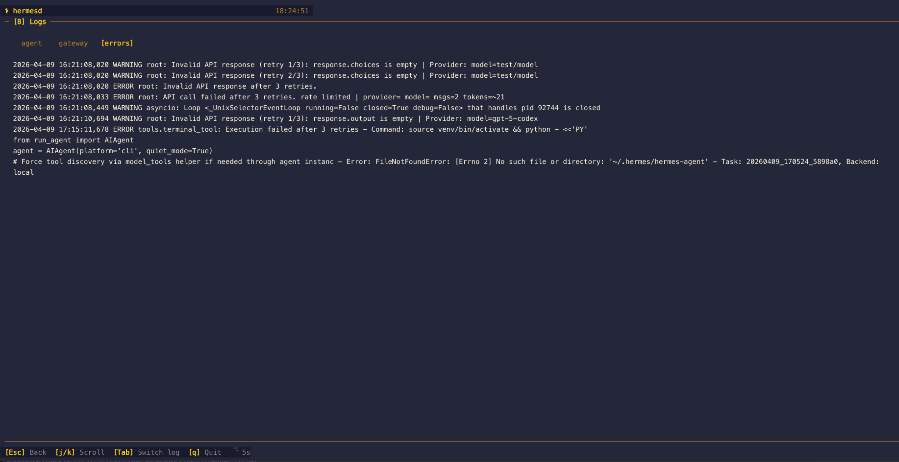

# hermesd

A real-time TUI monitoring dashboard for [Hermes Agent](https://github.com/NousResearch/hermes-agent).



## Why This Exists

When you run Hermes Agent seriously — gateway handling Telegram, Discord, Slack, and WhatsApp simultaneously, cron jobs firing reminders, multiple CLI sessions with sub-agents spawning sub-agents, dozens of skills loaded, 7+ LLM providers configured — the information gets scattered fast.

**The problem:** there was no single place to answer the obvious questions:
- Is my gateway actually running? Which platforms are connected?
- How many tokens have I burned today and what's the estimated cost?
- Which sessions are active and how much context are they consuming?
- What cron jobs are scheduled, and did the last one succeed or fail?
- Which skills are installed and what do they do?
- What's in my error log right now?

The only way to answer these was running `hermes status`, `hermes sessions list`, `hermes cron list`, tailing log files, and mentally stitching together a picture from 5+ different sources. That friction adds up.

**The solution:** `hermesd` — a single terminal command that reads `~/.hermes/` and presents everything in one live-updating dashboard. Gateway health, sessions, tokens, costs, tools, cron, skills, logs — all refreshed automatically, no API keys, no network access, zero writes to your agent state.

It's not trying to replace the Hermes CLI or your Telegram interface. It's the at-a-glance overview layer that tells you whether everything is healthy and where your tokens are going — so you can make decisions without hunting for data.

## Features

### 10 Dashboard Panels

| # | Panel | What It Shows |
|---|-------|---------------|
| 1 | **Gateway & Platforms** | Live gateway PID, Hermes version, update status, per-platform connection dots |
| 2 | **Sessions** | Active/total count, message and tool call totals, recent session list with parent-session lineage |
| 3 | **Tokens / Cost** | Today's and all-time token usage, estimated cost (~USD) from token counts, recent-window and model/provider breakdowns |
| 4 | **Tools** | Available tools count, per-session call stats, background processes, filesystem checkpoints, full tool name grid |
| 5 | **Config** | Model, provider, personality, max turns, reasoning, compression, security, routing and memory/session settings |
| 6 | **Cron** | Scheduler tick, job table with schedule, delivery target, error count, and latest output summary |
| 7 | **Skills / Integrations** | Provider auth status, credential pools, hooks/plugins/MCP inventory, BOOT.md presence, skills with descriptions |
| 8 | **Logs** | Tailed agent, gateway, error, and latest cron-output logs with Tab switching and inline filtering |
| 9 | **Profiles** | Read-only profile discovery with session counts, log freshness, skill counts, DB size, and SOUL excerpts |
| 10 | **Memory** | Memory provider, MEMORY.md/USER.md word counts, SOUL.md size/excerpt, and memory file inventory |

### Key Features

- **Read-only** — hermesd never writes to `~/.hermes/` or modifies Hermes Agent state
- **Live-updating** — polls every 5 seconds (configurable with `--refresh-rate`)
- **Snapshot mode** — `--snapshot` renders one overview frame to stdout and exits; `--snapshot-panel N` exports a single panel detail view; `--snapshot-file PATH` writes either form to disk
- **Opt-in profiles** — root mode stays the default; use `--profile NAME` or `HERMES_PROFILE=NAME` to read profile-scoped runtime data
- **Adaptive layout** — full 10-panel grid on wide terminals, a tall-narrow single-column overview for vertical tmux splits, and a denser all-panel overview on 80x24
- **Detail views** — press `1`-`9` or `0` for panel 10 to expand any panel to full-screen
- **Focus toggle** — press `f` to jump between the overview and the last selected full-screen panel
- **Clipboard export** — press `c` to copy the current rendered view as plain text via OSC 52 in compatible terminals
- **Inline detail filters** — press `/` in Sessions or Logs detail view to live-filter the current table/log stream with field-aware queries
- **Session sorting** — press `s` in Sessions detail to cycle recent/cost/token ordering
- **Jump navigation** — press `g` / `G` in scrollable detail views to jump to the top or bottom
- **Footer health indicator** — a green/yellow/red dot shows how many collector sources succeeded on the last refresh, with failed source names surfaced inline when degraded
- **Offline banner** — when Hermes Agent appears inactive, the header/footer surface an `AGENT OFFLINE` warning instead of silently showing stale-looking idle data
- **Scrollable lists** — `j`/`k` scroll both skills and log detail views
- **Profile inspection** — press `p` inside the Profiles panel to cycle the viewed profile without changing the selected data source
- **Resilient** — keeps showing last known good data on transient SQLite and log-read failures
- **Theme-aware** — inherits your Hermes Agent skin and updates live when `config.yaml` changes
- **SSH/tmux compatible** — `tty.setcbreak` mode, escape sequence handling for remote terminals
- **Cost estimation** — computes ~USD from token counts when the provider doesn't report costs
- **Zero config** — no config file, no API keys, just `hermesd` and go

## Screenshots

### Overview — The Full Picture

The main dashboard shows all 10 panels at a glance. Gateway status with PID and version at the top, sessions and token costs side by side, tools and config, cron and skills, logs plus profile metadata, and a dedicated memory panel at the bottom. The footer shows keyboard shortcuts and a polling indicator.


### [1] Gateway & Platforms — Is Everything Connected?

Press `1` to expand. Shows whether the gateway process is alive (with correct PID even after launchd restarts), Hermes version with update status, and a per-platform table with connection state and last-seen timestamps. Catches the "gateway says running but the PID is dead" case.



### [2] Sessions — What’s Active and Where Did It Fork?

Press `2` to expand. The detail table now includes billing metadata plus parent-session lineage, so compression splits and child sessions are easier to spot without querying the DB directly. Press `/` to filter the currently loaded sessions by ID, source, model, lineage, provider, or title, and press `s` to cycle recent/cost/token sorting.

### [3] Tokens / Cost — Where Are My Tokens Going?

Press `3` for the full per-session token breakdown plus recent `7d`/`30d` rollups and read-only model/provider cost summaries derived from the current session table. The compact view shows today's totals with `~$` prefix indicating estimated costs when the provider (e.g., OpenAI Codex) doesn't report them.



### [4] Tools — What's Available and What's Being Used?

Press `4` for four sections: **Tool Calls** showing per-session call counts, **Available Tools** listing the union of tools discovered across session files in a 3-column grid, **Background Processes** showing the running `processes.json` checkpoint with PID, notify-on-complete, watch-pattern summary, start time, and command, and **Checkpoints** showing filesystem shadow repos with workdir name, commit depth, and latest checkpoint reason. The compact view shows the top callers plus the current background-process and checkpoint counts.



### [5] Config — Current Agent Configuration

Press `5` for the full config key-value table: model, provider, personality, max turns, reasoning effort, compression threshold, secret redaction, approval mode, provider routing summary, smart routing, fallback model, dashboard theme, session reset mode, memory provider, and Tool Gateway routing for `web`, `image_gen`, `tts`, and `browser`. Tool Gateway domain, scheme, Firecrawl endpoint, and token presence are shown from config plus environment without exposing secrets.



### [6] Cron — Scheduled Jobs

Press `6` to see all cron jobs with their schedule, delivery target, current state, last execution status, and latest saved output summary from `~/.hermes/cron/output/`. `[SILENT]` runs are surfaced explicitly so “nothing to report” is distinguishable from missing output.



### [7] Skills & Integrations — What's Installed?

Press `7` for provider and integration visibility in one place: **Providers** with active auth state, **Credential Pools** with redacted metadata, **Hooks** discovered from `~/.hermes/hooks/`, **Plugins** from `~/.hermes/plugins/`, **MCP Servers** from `config.yaml`, `BOOT.md` presence, and **Skills** grouped by category with descriptions loaded from each skill's `SKILL.md` frontmatter. Use `j`/`k` to scroll through the full skill list.



### [8] Logs — What Just Happened?

Press `8` for the full log viewer with four tabs: **agent**, **gateway**, **errors**, and **cron**. Press `Tab` to switch between them, `/` to filter the current log stream by `level:`, `component:`, `session:`, or free text, `j`/`k` to move the viewport, and `g`/`G` to jump to the top or bottom. Log lines are color-coded by level (INFO green, WARNING orange, ERROR red), while the cron tab shows the most recent saved cron output file.



### [9] Profiles — Which Runtime State Am I Looking At?

Press `9` for a read-only profile table discovered from `~/.hermes/profiles/*/`. It shows per-profile session count, latest log mtime, skill count, DB size, and a short `SOUL.md` excerpt when present. Press `p` in this panel to cycle the viewed profile highlight without changing the dashboard's selected data source.

### [10] Memory — What Context Is Persisted?

Press `0` to expand. The Memory panel shows the configured memory provider, memory-file count, `MEMORY.md` and `USER.md` word counts, `SOUL.md` size, and a short `SOUL.md` excerpt with the discovered memory files listed below.

## Installation

Requires Python 3.11+ and a working [Hermes Agent](https://github.com/NousResearch/hermes-agent) installation (`~/.hermes/` must exist).

### Via pip

```bash
pip install hermesd
hermesd
hermesd --snapshot
```

### Via uv

```bash
uv tool install hermesd
hermesd
```

### From Source

```bash
git clone https://github.com/mudrii/hermesd.git
cd hermesd
uv venv .venv --python 3.11
source .venv/bin/activate
uv pip install -e .
hermesd
```

### Docker

```bash
docker build -t hermesd .
docker run -it -v ~/.hermes:/home/hermesd/.hermes:ro hermesd
```

### Nix Flake

```bash
# Run directly
nix run github:mudrii/hermesd

# Dev shell
nix develop github:mudrii/hermesd
```

## Usage

```bash
# Launch the dashboard (reads ~/.hermes by default)
hermesd

# Custom hermes home directory
hermesd --hermes-home ~/.hermes-work

# Read profile-scoped runtime data from ~/.hermes/profiles/coding
hermesd --profile coding

# Faster polling (every 2 seconds)
hermesd --refresh-rate 2

# Disable colors
hermesd --no-color

# Show version
hermesd --version

# Write a one-shot overview snapshot to a file
hermesd --snapshot-file /tmp/hermesd.txt

# Export a single panel detail snapshot
hermesd --snapshot-panel 10
```

### Environment Variables

| Variable | Default | Description |
|----------|---------|-------------|
| `HERMES_HOME` | `~/.hermes` | Override the Hermes home directory |
| `HERMES_PROFILE` | unset | Read profile-scoped runtime data from `profiles/<name>`; root mode remains the default when unset |

## Keyboard Shortcuts

| Key | Action |
|-----|--------|
| `1`-`9`, `0` | Expand panel to full-screen detail view (`0` opens panel 10) |
| `Esc` | Return to overview |
| `f` | Toggle focus mode for the last selected panel |
| `c` | Copy the current rendered view as plain text via OSC 52 |
| `j` / `k` | Scroll down/up in detail mode |
| `Tab` | Cycle log sub-view: agent / gateway / errors / cron (panel 8) |
| `/` | Edit the inline filter for Sessions or Logs detail |
| `s` | Cycle session sort in Sessions detail |
| `g` / `G` | Jump to top/bottom in scrollable detail views |
| `r` | Force immediate refresh |
| `q` | Quit |
| `?` | Toggle help overlay |

## Architecture

hermesd is a **read-only companion** — it reads files from `~/.hermes/` and never writes anything.

```
~/.hermes/                        hermesd
  state.db (SQLite WAL) ───────> db.py      Read-only (mode=ro), data_version cache
  gateway_state.json ──────────> collector.py  JSON/YAML mtime-cached readers
  gateway.pid ─────────────────>
  config.yaml ─────────────────>
  cron/jobs.json ──────────────>
  auth.json ───────────────────>
  skills/*/SKILL.md ───────────>
  sessions/*.json ─────────────>
  logs/*.log ──────────────────>
                                     |
                                     v
                                 models.py   Pydantic DashboardState
                                     |
                                     v
                                 app.py      Rich TUI (Live + Layout + threads)
                                     |
                                     v
                                 panels/*.py  10 panel renderers (compact + detail)
```

### Design Decisions

| Decision | Why |
|----------|-----|
| SQLite `mode=ro` + `check_same_thread=False` | Guarantees no writes; safe for cross-thread polling/render |
| `PRAGMA data_version` caching | Skips re-reads when agent hasn't written, minimizing I/O |
| Cache preservation on error | Transient SQLite lock contention keeps last good data visible |
| Auto-reconnect after 3 errors | Recovers from WAL checkpoint invalidation |
| `gateway.pid` fallback | Detects correct PID after launchd/systemd restarts |
| `tty.setcbreak` (not `setraw`) | Preserves signal handling over SSH/tmux |
| `os.read(fd, 64)` bulk read | Captures escape sequences as single chunks |
| Cost estimation from tokens | Shows ~USD when provider doesn't report costs |
| Adaptive layout threshold | 80x24 gets compact single-column; 100+ gets full grid |

## Themes

hermesd inherits the active skin from Hermes Agent's `config.yaml`:

| Skin | Style |
|------|-------|
| `default` | Gold/bronze on dark — the classic Hermes look |
| `ares` | Deep red with gold accents |
| `mono` | Grayscale minimalist |
| `slate` | Cool blue tones |
| `poseidon` | Ocean blue |
| `sisyphus` | Silver/stone gray |
| `charizard` | Warm orange/amber |

## Development

```bash
git clone https://github.com/mudrii/hermesd.git
cd hermesd
uv venv .venv --python 3.11
source .venv/bin/activate
uv pip install -e ".[dev]"

# Run the full local gate set — matches CI across Python 3.11/3.12/3.13
uv run ruff check .
uv run ruff format --check .
uv run mypy hermesd
uv run pytest tests/ -v          # 274 tests, <0.5s
uv run pip-audit

# Run the dashboard
hermesd
```

See [`CONTRIBUTING.md`](CONTRIBUTING.md) for the full TDD-first contributor workflow.

### Project Structure

```
hermesd/
  __init__.py          Version string
  __main__.py          CLI entry point (argparse)
  app.py               Rich TUI: Live context, input thread, adaptive layout
  collector.py         Reads all ~/.hermes data sources
  db.py                Read-only SQLite with data_version caching
  models.py            Pydantic models for dashboard state
  theme.py             Skin/color system matching Hermes Agent
  panels/
    __init__.py        Panel dispatch and registry
    gateway.py         [1] Gateway & Platforms
    sessions.py        [2] Sessions
    tokens.py          [3] Tokens / Cost
    tools.py           [4] Tools
    config_panel.py    [5] Config
    cron.py            [6] Cron
    overview.py        [7] Skills / Integrations
    memory_panel.py    [10] Memory
    logs.py            [8] Logs
tests/                 274 tests: panels, data, resilience, edge cases
```

### Adding a Panel

hermesd uses **TDD-first** contribution (see [`CONTRIBUTING.md`](CONTRIBUTING.md)). Write the failing test first, then implement:

1. Write the failing test in `tests/test_your_panel.py` — acceptance-level (full `Collector → DashboardState → render` flow) + unit tests for edge cases
2. Add data model to `hermesd/models.py`
3. Collect data in `hermesd/collector.py`
4. Create `hermesd/panels/your_panel.py` with `render_*(state, theme, detail)` function
5. Register in `hermesd/panels/__init__.py`
6. Add to layout in `hermesd/app.py`
7. Update `CHANGELOG.md` under `[Unreleased]`

## Requirements

- **Python** >= 3.11
- **Hermes Agent** installed with `~/.hermes/` directory present
- **Terminal** with 256-color or truecolor support

### Dependencies

Only 3 runtime dependencies — all of which are already installed as part of Hermes Agent, so hermesd adds **zero new packages** to your system:

| Package | Version | Purpose | In hermes-agent? |
|---------|---------|---------|------------------|
| `rich` | >= 14.0 | TUI rendering (Live, Layout, Panel, Table, Text) | Yes (`rich>=14.3.3`) |
| `pyyaml` | >= 6.0 | Reading config.yaml | Yes (`pyyaml>=6.0.2`) |
| `pydantic` | >= 2.0 | Data models and validation | Yes (`pydantic>=2.12.5`) |

If you install hermesd into the same environment as Hermes Agent, no additional downloads are needed.

## License

[MIT License](LICENSE)

## Credits

Built for [Hermes Agent](https://github.com/NousResearch/hermes-agent) by [Nous Research](https://nousresearch.com).
